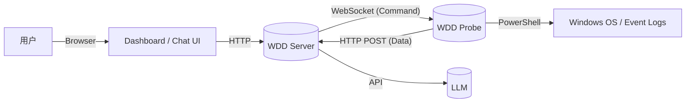

# 🩺 WinDiagDoctor (WDD)

> **智能 Windows 系统诊断专家 / Intelligent Windows Diagnostic Agent**

> **⚠️ 注意：本项目当前仍处于早期开发阶段。**
>
> - **架构稳定性**：API 接口、通信协议（WebSocket/HTTP）以及数据模型可能会发生破坏性变更。
> - **功能完整性**：目前主要实现了核心的日志诊断闭环，更多系统监控和修复功能正在开发中。
> - **生产环境**：**强烈不建议**在生产环境或关键业务机器上部署，仅供学习、研究和测试使用。

在传统的 Windows 运维和故障排查中，用户可能面临以下问题：

1. **门槛高**：需要熟练掌握 PowerShell 命令或能够看懂晦涩的 Event Viewer（事件查看器）结果。
2. **效率低**：需要在海量的日志中手动筛选关键错误，耗时耗力。
3. **远程难**：当亲友或客户电脑出问题时，往往需要使用远程桌面工具，不仅带宽要求高，还依赖人工操作。

**WinDiagDoctor** 旨在打造一个**基于大语言模型（LLM）的智能体**。用户只需用自然语言描述问题（如“电脑刚才死机了”），由智能体自动调度远程探针，精准采集数据，并给出专业的诊断建议以及解决方案。

## ✨ 功能特性

### 🧠 智能大脑 (Server)

- **Spring AI Alibaba 驱动**：集成通义千问（Qwen）等高性能大模型，具备强大的意图理解和逻辑推理能力。
- **ReAct 智能体**：内置 `wdd-agent`，采用 **ReAct (Reasoning + Acting)** 模式，能够自我思考、规划任务、调用工具并反思结果。
- **可视化交互**：集成 **Spring AI Alibaba Studio**，提供现代化的聊天界面，支持流式对话和思维链展示。
- **多探针管理**：支持多用户、多设备接入，通过 Dashboard 实时监控探针在线状态。
- **数据优化**：采用 [TOON](https://github.com/toon-format) 格式传输日志，相比 JSON 节省大量的 Token 消耗，大幅提升 AI 分析窗口的容量。

### 📡 远程探针 (Probe)

- **轻量级架构**：基于 **Spring Context** 构建，资源占用低，静默运行。
- **零配置部署**：通过服务端动态生成的 ZIP 包分发，内含专属 ID 和密钥，**下载即用**，无需手动配置 IP。
- **双向通信**：
  - **WebSocket**：用于接收服务端的实时控制指令（心跳保活、任务下发）。
  - **HTTP/REST**：用于上传大体积的日志数据。

### 🛡️ 安全与隐私

- **Probe 认证**：基于 `Probe ID` + `Secret` 的双重认证机制。
- **按需采集**：探针仅在收到 AI 指令时执行特定操作，不会在后台随意上传用户数据。
- **数据脱敏（待开发）**：探针在向服务器发送数据前，会先将数据中的敏感数据进行模糊处理。

## 🛠️ 使用方法

### 前置要求

- JDK 17+
- 阿里云 DashScope API Key (用于驱动 AI)

### 1. 启动服务端 (Server)

1. **配置环境**：修改 `server-app/src/main/resources/application.yml` 或者配置对应的环境变量：

   ```yaml
   spring:
     ai:
       dashscope:
         # 参考官方文档获取 API Key：
         # https://help.aliyun.com/zh/model-studio/first-api-call-to-qwen?spm=a2c4g.11186623.help-menu-2400256.d_0_0_1.30237dc5FLsnId
         api-key: ${AI_DASHSCOPE_API_KEY}
     config:
       name: win-diag-doctor
   
     security:
       user:
         # 默认管理员账号密码，可通过环境变量覆盖
         name: ${WDD_USER_NAME:admin}
         password: ${WDD_USER_PASSWORD:admin}
         roles: ADMIN
   
   wdd:
     probe:
       template-path: data/probe-templates
       # 默认连接密钥，用作哈希盐值，可通过环境变量覆盖
       connect-key: ${WDD_PROBE_CONNECT_KEY:default_connect_key}
   
   server:
     port: 8093
     forward-headers-strategy: native
   ```

2. （如果以开发模式启动，此步可以省略）打包 Probe 客户端：`mvn clean compile package -Pbundle-exe`

3. **运行**：启动 `WinDiagDoctorMainApplication`。

4. 访问 Dashboard：打开浏览器访问 http://localhost:8093/dashboard.html。

### 2. 部署探针 (Probe)

1. 在 Dashboard 页面中，点击右上角的 **“下载探针”** 按钮。
   - *推荐选择“完整版 (Full)”以包含必要的运行环境。*
2. 将下载的 ZIP 包解压到目标 Windows 机器上。
3. 双击运行 `WddProbe.exe` (或直接运行 `ProbeMainApplication`)。
4. 回到 Dashboard 并刷新状态，您应能看到该探针状态变为 **ONLINE**。

### 3. 开始诊断

1. 在 Dashboard 列表中，点击目标探针卡片上的 **“进入诊断”**。
2. 系统会自动跳转到聊天界面。
3. **输入问题**：
   - “帮我看看昨天下午为什么电脑突然重启了？”
   - “最近 Chrome 浏览器总是闪退，查一下原因。”
4. **查看结果**：AI 将自动调用探针抓取日志，分析后给出诊断报告。

## 📋 架构概览



## ⚖️ 声明

1. 本项目涉及对 Windows 系统日志的读取。虽然代码开源且透明，但在使用过程中产生的数据泄露或隐私风险由使用者自行承担。
2. 本工具提供的诊断建议由 AI 生成，**可能存在幻觉或错误**。在执行任何修复操作（如修改注册表、删除文件）前，请务必进行人工确认。
3. 本项目不提供任何形式的明示或暗示担保。作者不对因使用本软件造成的任何系统损坏或数据丢失负责。

---

<div align=center> 
💬任何使用中遇到的问题、希望添加的功能，都欢迎提交 issue 交流！<br />
⭐ 如果这个项目对你有帮助，请给它一个星标！<br /> <br /> 
</div>